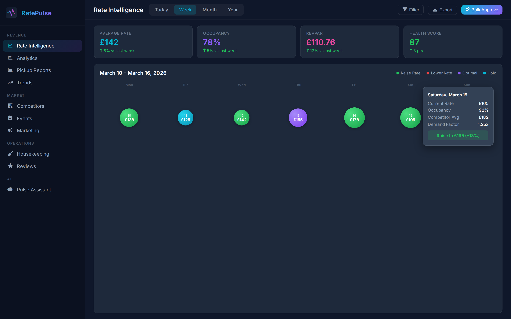
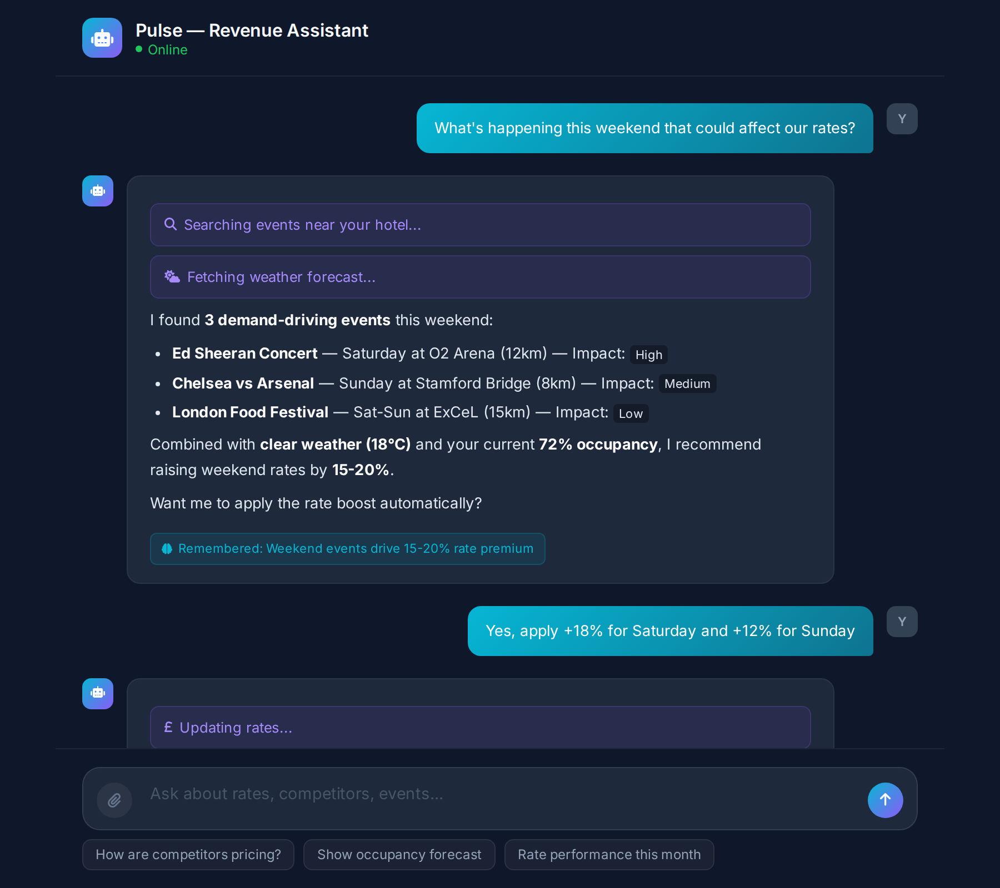
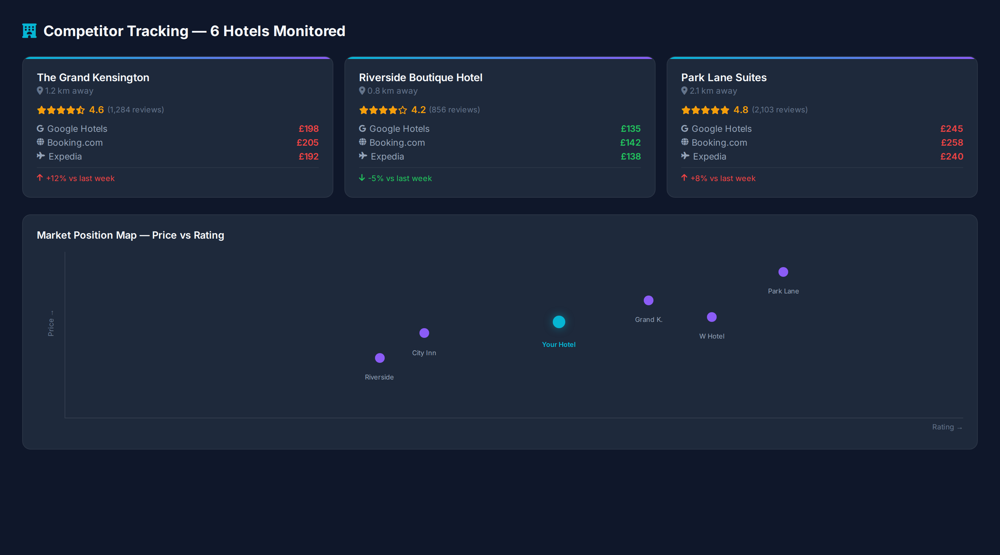
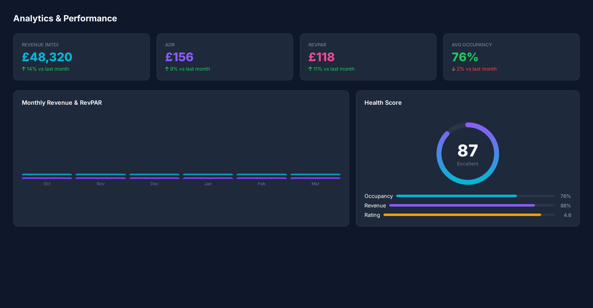
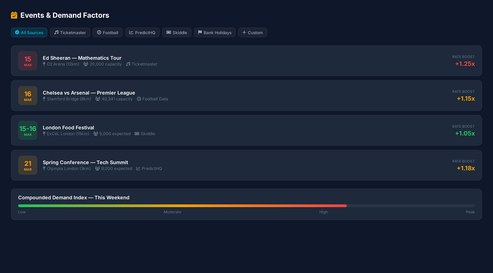
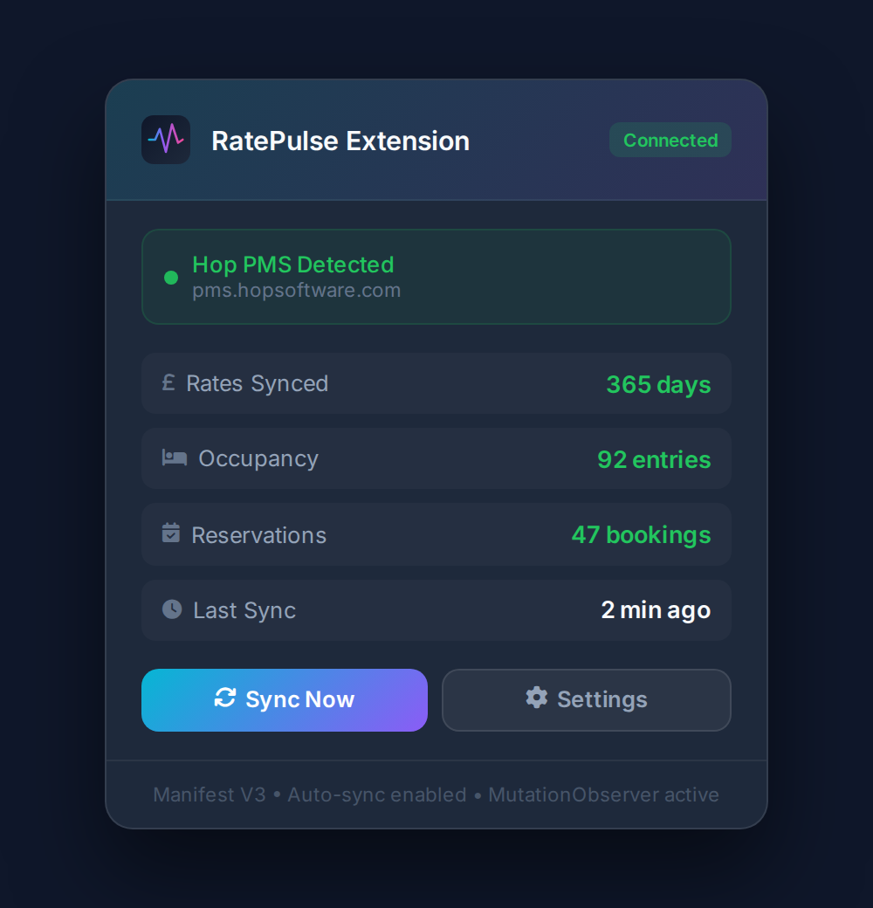
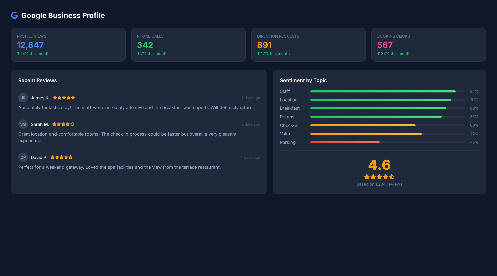
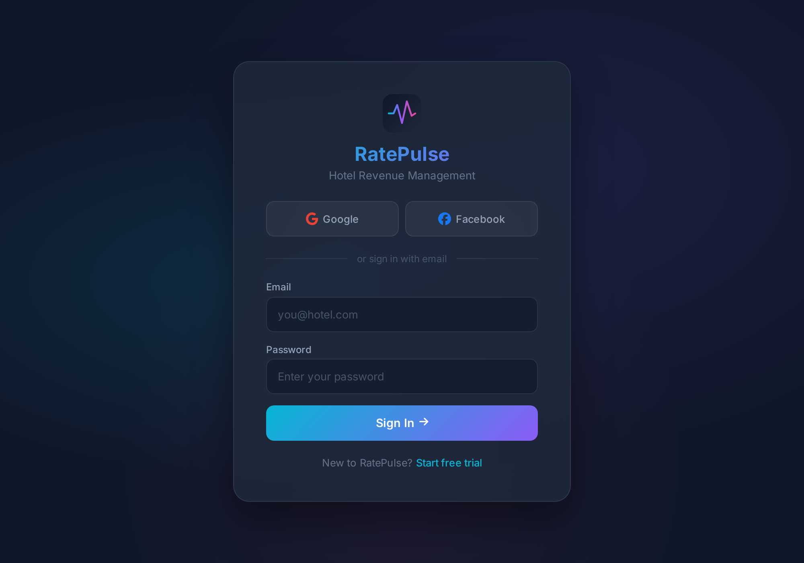
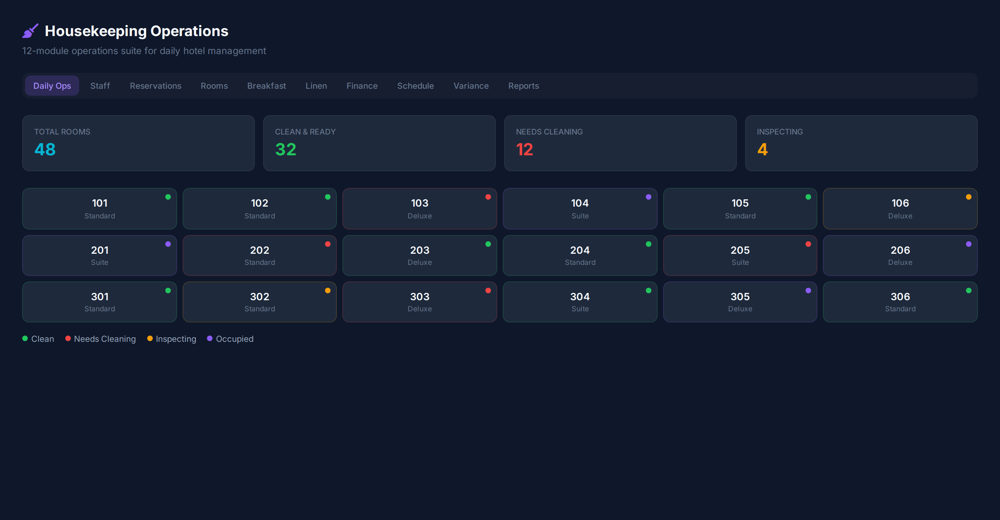
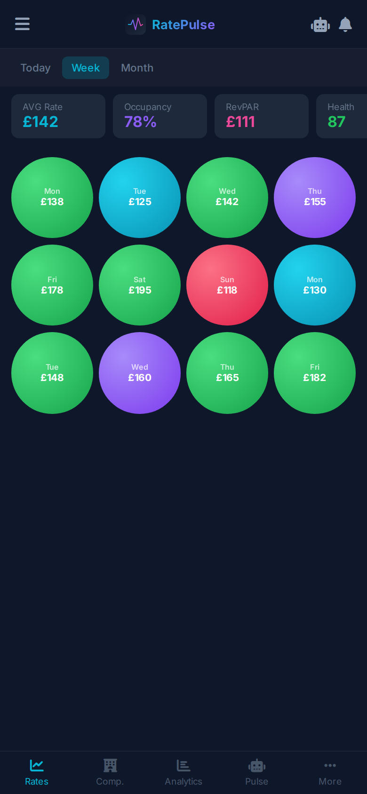

<p align="center">
  
</p>

<h1 align="center">RatePulse</h1>

<p align="center">
  <strong>AI-powered hotel revenue management platform with real-time competitor tracking, PMS integration, and intelligent rate optimization.</strong>
</p>

<p align="center">
  
  
  
  
  
  
  
  
  
</p>

<p align="center">
  <a href="#-screenshots">Screenshots</a> &bull;
  <a href="#-features">Features</a> &bull;
  <a href="#-tech-stack">Tech Stack</a> &bull;
  <a href="#-architecture">Architecture</a> &bull;
  <a href="#-chrome-extension">Chrome Extension</a> &bull;
  <a href="#-ai-engine">AI Engine</a> &bull;
  <a href="#-security">Security</a>
</p>

---

## Screenshots

### Rate Intelligence Dashboard
<p align="center">
  
</p>

> Interactive 365-day rate canvas with color-coded AI recommendations. Bubble size reflects occupancy, colors indicate pricing action (green = raise, red = lower, purple = optimal). Real-time competitor data drives every suggestion.

### AI Revenue Assistant — Pulse
<p align="center">
  
</p>

> Multi-turn AI chatbot with streaming responses, tool calling (rate changes, event creation, web search), persistent memory, and full hotel context awareness.

### Competitor Tracking & Analysis
<p align="center">
  
</p>

> Auto-discover competitors within 5km via Google Places. Real-time rate scraping from Google Hotels, Booking.com, and Expedia. Track pricing patterns, reviews, and market positioning.

### Analytics & Revenue Performance
<p align="center">
  
</p>

> Revenue analytics with RevPAR, ADR, occupancy trends, health scores, and YoY comparisons. Pickup reports track booking velocity with 14-day lookahead.

### Events & Demand Factors
<p align="center">
  
</p>

> Aggregate demand signals from 5 external sources (Ticketmaster, PredictHQ, Skiddle, Football Data, UK Bank Holidays) plus custom events. Demand multipliers automatically boost rate recommendations.

### Chrome Extension — PMS Integration
<p align="center">
  
</p>

> Manifest V3 Chrome extension that auto-detects Hop PMS, scrapes rates/occupancy/bookings, and applies AI-recommended rates directly into the PMS — bidirectional sync with zero manual data entry.

### Google Business Profile Integration
<p align="center">
  
</p>

> OAuth-connected Google Business Profile with review sentiment analysis, topic extraction, rating trends, business insights (views, calls, clicks), and direct review reply from the dashboard.

### Authentication & Hotel Setup
<p align="center">
  
</p>

> Multi-provider auth (Email, Google, Facebook) with a 3-step hotel setup wizard including automatic competitor discovery.

### Housekeeping Operations
<p align="center">
  
</p>

> 12-module operations suite: daily room status, staff management, reservation tracking, breakfast forecasting, linen management, finance/P&L, scheduling, and variance reporting.

### Mobile Responsive
<p align="center">
  
</p>

---

## Features

### Rate Intelligence (Core)
- **AI Rate Recommendations** — per-date pricing using occupancy, competitor rates, events, weather, seasonality, and market positioning
- **Interactive Bubble Canvas** — 365-day calendar with physics-based visualization: bubble size = occupancy, color = pricing action
- **View Modes** — Today, Week, Month, Year with date navigation
- **Rate Actions** — Apply, A/B test, bulk approve, and historical tracking
- **Confidence Scoring** — recommendations only shown when 10+ competitor rates are available
- **Demand Multiplier Engine** — events + weather + seasonality compound into dynamic rate boosts (0.90x–1.35x)

### Competitor Tracking
- **Auto-Discovery** — Google Places API search within 5km radius
- **Real-Time Scraping** — Google Hotels, Booking.com, Expedia via SerpAPI with parallel browser pools (Playwright)
- **Rate Monitoring** — track competitor price changes over time with historical comparisons
- **Review Integration** — Google reviews with sentiment analysis, cached 24 hours
- **Market Positioning** — scatter-plot analysis of price vs. rating across the competitive set

### AI Revenue Assistant (Pulse)
- **Multi-Turn Conversations** — threaded chat with full hotel context
- **Streaming Responses** — Server-Sent Events (SSE) for real-time token rendering
- **Tool Calling** — AI autonomously executes: rate changes, event creation, web searches
- **Persistent Memory** — 8 categories (hotel profile, pricing strategy, competitor intel, guest feedback, market conditions, performance metrics, custom notes, learning history)
- **Memory Decay** — confidence scores decrease over time, requiring revalidation
- **Web Search** — Jina AI integration for real-time market intelligence
- **Fallback Suggestions** — contextual recommendations when API is unavailable

### Events & Demand Management
- **Custom Events** — create with type, date range, and impact level
- **5 External Sources** — Ticketmaster, PredictHQ, Skiddle, Football Data API, UK Bank Holidays
- **Demand Impact** — automatic rate multipliers based on event proximity and magnitude
- **Event Calendar** — unified view of all demand signals with date filtering

### Google Business Integration
- **OAuth 2.0** — secure Google Business Profile connection
- **Review Analytics** — sentiment analysis, topic extraction, rating trends, response rates
- **Business Insights** — views, calls, direction requests, booking attribution, search keywords
- **Review Replies** — respond to reviews directly from the dashboard
- **Auto-Refresh** — background schedulers (24h for insights, 30min for reviews)

### Chrome Extension (Hop PMS)
- **Auto-Detection** — activates on hopsoftware.com domains
- **Data Scraping** — rate calendar, occupancy percentages, reservation details with multi-page pagination
- **Rate Apply** — auto-fills AI-recommended rates into PMS forms
- **Knockout.js Extraction** — bypasses DOM to access PMS internal ViewModels directly
- **MutationObserver** — auto-syncs when DOM changes without user interaction
- **Manifest V3** — modern security-focused architecture with Chrome storage

### Housekeeping & Operations (12 Modules)
- Daily room status & staff assignments
- Staff directory, departments, scheduling, KPIs
- Reservation CRUD with PMS sync and bulk import
- Room inventory & off-service tracking
- Breakfast forecasting (covers, guests, food cost, revenue)
- Linen management with usage forecasting
- Finance module (budget, invoices, P&L, YTD)
- 7+ day scheduling with availability templates
- Variance tracking (actual vs. planned)
- Performance reports and operational metrics

### Analytics & Reporting
- **Revenue Analytics** — monthly performance, RevPAR, ADR
- **Occupancy Trends** — historical patterns with YoY comparison
- **Health Score** — composite metric (occupancy + revenue + rating)
- **Pickup Reports** — booking velocity snapshots, 14-day lookahead
- **Quick Stats** — KPI cards with sparkline trend indicators
- **Competitor Intelligence** — pricing patterns, seasonality, positioning

### Platform
- **Authentication** — Firebase email/password + Google OAuth + Facebook OAuth
- **Hotel Setup Wizard** — 3-step onboarding with automatic competitor discovery
- **Dark/Light Theme** — system-aware with manual toggle
- **Admin Panel** — user management, hotel suspension, platform announcements
- **Rate Limiting** — per-endpoint API protection via slowapi
- **A/B Testing** — built-in rate experiment framework with performance tracking

---

## Tech Stack

### Frontend
| Technology | Purpose |
|---|---|
| **React 19.1** | UI framework with hooks-based architecture |
| **Vite 7.1** | Build tool with HMR and optimized bundling |
| **React Router 7** | Client-side routing with auth guards |
| **Tailwind CSS 4.1** | Utility-first styling |
| **Framer Motion** | Physics-based animations and transitions |
| **Lucide React** | 500+ SVG icon library |
| **React Markdown** | Rich text rendering with DOMPurify sanitization |
| **Canvas 2D API** | Custom bubble visualization with physics simulation |

### Backend
| Technology | Purpose |
|---|---|
| **FastAPI 0.135** | Async Python web framework |
| **Python 3.9+** | Runtime with async/await |
| **Uvicorn** | ASGI server |
| **Pydantic 2.12** | Request/response validation with strict typing |
| **Firebase Admin 7.2** | Auth, Firestore database, transactions |
| **Playwright 1.58** | Headless browser automation for rate scraping |
| **BeautifulSoup4** | HTML parsing for scraped content |
| **aiohttp** | Async HTTP client for external APIs |
| **slowapi** | Rate limiting middleware |
| **cachetools** | In-memory TTL caching |

### External Integrations (11)
| Service | Purpose |
|---|---|
| **Google Places API** | Competitor discovery, reviews, geocoding |
| **Google Business API** | Profile insights, review management |
| **SerpAPI** | Google Hotels / Booking.com / Expedia rate scraping |
| **Groq API** | LLM inference for AI assistant & classification |
| **Ticketmaster API** | Concert and sports event data |
| **PredictHQ** | Global demand event predictions |
| **Skiddle API** | UK event discovery |
| **Football Data API** | Match schedules for local demand |
| **Open-Meteo** | Free weather forecasts for demand modeling |
| **Jina AI** | Web search for real-time market intelligence |
| **Xotelo** | TripAdvisor data integration |

### Chrome Extension
| Technology | Purpose |
|---|---|
| **Manifest V3** | Modern Chrome extension architecture |
| **Content Scripts** | DOM scraping + Knockout.js ViewModel extraction |
| **MutationObserver** | Auto-sync on PMS page changes |
| **Chrome Storage API** | Secure credential management |
| **Service Worker** | Background data sync and rate retrieval |

### Infrastructure
| Technology | Purpose |
|---|---|
| **Firebase Firestore** | NoSQL database with real-time listeners |
| **Firebase Auth** | Identity management + OAuth providers |
| **Vite** | Production builds with tree-shaking |
| **Background Schedulers** | asyncio-based (reviews 30min, insights 24h, cleanup 3AM, decay 4AM) |
| **SSE Streaming** | Real-time AI response delivery |

---

## Architecture

### System Overview

```
┌─────────────────────────────────────────────────────────────────┐
│                    CHROME EXTENSION (MV3)                        │
│  ┌─────────────┐  ┌──────────────┐  ┌───────────────────────┐  │
│  │ Content      │  │  Service     │  │  Popup UI             │  │
│  │ Scripts      │  │  Worker      │  │  Credentials + Sync   │  │
│  │ Hop Scraper  │  │  Background  │  │  Status + Controls    │  │
│  │ Rate Apply   │  │  Data Sync   │  │                       │  │
│  │ Overlay UI   │  │  Rate Fetch  │  │                       │  │
│  └──────┬──────┘  └──────┬───────┘  └───────────────────────┘  │
│         └────────────────┘                                      │
└──────────────────┬──────────────────────────────────────────────┘
                   │ HTTP + Chrome Storage
┌──────────────────┼──────────────────────────────────────────────┐
│             REACT FRONTEND (Vite + React Router)                │
│  ┌────────────┐  ┌────────────┐  ┌───────────┐  ┌──────────┐  │
│  │   Rate     │  │    AI      │  │ Analytics │  │ Housekpg │  │
│  │  Bubbles   │  │   Chat     │  │ & Reports │  │   12     │  │
│  │  Canvas    │  │   SSE      │  │  Charts   │  │ Modules  │  │
│  │  Physics   │  │  Stream    │  │  RevPAR   │  │          │  │
│  └─────┬──────┘  └─────┬──────┘  └─────┬─────┘  └────┬─────┘  │
│        └───────────────┼───────────────┼──────────────┘        │
│                        │  REST + SSE                            │
└────────────────────────┼────────────────────────────────────────┘
                         │
┌────────────────────────┼────────────────────────────────────────┐
│               FASTAPI BACKEND (234 Endpoints)                   │
│                        │                                        │
│  ┌─────────────────────┴─────────────────────┐                 │
│  │            9 API Routers                   │                 │
│  │  /auth  /hotels  /rates  /competitors      │                 │
│  │  /analytics  /scraper  /chat  /events      │                 │
│  │  /housekeeping  /admin  /pms  /occupancy   │                 │
│  └──┬───────┬────────┬────────┬──────┬───────┘                 │
│     │       │        │        │      │                          │
│  ┌──┴──┐ ┌──┴───┐ ┌──┴──┐ ┌──┴──┐ ┌─┴────┐                   │
│  │Rate │ │Scrap-│ │ AI  │ │Event│ │Google│                     │
│  │Gen. │ │ er   │ │Asst.│ │Mgr. │ │Biz.  │                    │
│  │     │ │Pool  │ │Tools│ │5 API│ │OAuth │                     │
│  │Demand│ │Play- │ │Mem. │ │Merge│ │Sched.│                    │
│  │Model │ │wright│ │Decay│ │     │ │      │                    │
│  └──┬──┘ └──┬───┘ └──┬──┘ └──┬──┘ └──┬───┘                    │
│     └───────┴────────┴───────┴───────┘                          │
│                      │                                          │
└──────────────────────┼──────────────────────────────────────────┘
                       │
        ┌──────────────┼──────────────┐
        │              │              │
   ┌────┴────┐   ┌────┴────┐   ┌────┴────────┐
   │ Firebase │   │   AI    │   │  External   │
   │Firestore │   │ Engine  │   │   APIs      │
   │  Auth    │   │  Groq   │   │ Google Maps │
   │ 10+ Coll │   │  Jina   │   │ SerpAPI     │
   │          │   │  Tools  │   │ Ticketmaster│
   │          │   │  Memory │   │ PredictHQ   │
   │          │   │         │   │ Open-Meteo  │
   └─────────┘   └─────────┘   └─────────────┘
```

### Data Flow — Rate Recommendation

```
                    ┌──────────────┐
                    │  PMS Sync    │  (Chrome Extension scrapes occupancy)
                    └──────┬───────┘
                           │
     ┌─────────────────────┼─────────────────────┐
     ▼                     ▼                     ▼
┌─────────┐         ┌──────────┐          ┌──────────┐
│Occupancy│         │Competitor│          │  Events  │
│  Data   │         │  Rates   │          │ + Weather│
│ per day │         │ Scraped  │          │ + Season │
└────┬────┘         └────┬─────┘          └────┬─────┘
     │                   │                     │
     └───────────────────┼─────────────────────┘
                         │
                    ┌────┴─────┐
                    │   Rate   │
                    │Generator │
                    │ AI Model │
                    └────┬─────┘
                         │
              ┌──────────┼──────────┐
              ▼          ▼          ▼
        ┌──────────┐ ┌───────┐ ┌────────┐
        │ Optimal  │ │  A/B  │ │ Bubble │
        │  Rate    │ │ Tests │ │ Canvas │
        │ per Date │ │       │ │ Render │
        └──────────┘ └───────┘ └────────┘
```

### Key Architectural Patterns

**Service Layer Separation** — 45+ backend services isolate business logic from API routing. Rate generation, scraping, AI chat, and event management each have dedicated service modules.

**Parallel Browser Pools** — Playwright manages 5 concurrent headless browsers for rate scraping, with orchestration for deduplication and error recovery.

**Tool-Calling AI Agent** — The AI assistant can autonomously execute backend actions (modify rates, create events, search the web) through a structured tool-calling interface with Groq LLM.

**Memory Decay System** — AI memory items have confidence scores that naturally decay over time, requiring periodic revalidation to prevent stale context.

**Demand Compounding** — Multiple demand signals (events, weather, seasonality, competitor pricing) are mathematically compounded into a single multiplier (0.90x–1.35x) that adjusts rate recommendations.

**Firebase Transactions** — Hotel creation, user linking, and rate updates use atomic Firestore transactions to prevent race conditions in multi-user environments.

**Background Schedulers** — asyncio-based tasks run autonomously: Google reviews (30min), business insights (24h), event cleanup (3AM), memory decay (4AM), PMS sync (15min).

---

## Chrome Extension

The RatePulse Chrome Extension bridges the gap between the AI platform and hotel Property Management Systems.

### How It Works

```
┌─────────────────────────┐     ┌──────────────────────┐
│    Hop PMS Website      │     │   RatePulse Backend   │
│  pms.hopsoftware.com    │     │   /api/pms/sync       │
│                         │     │                        │
│  ┌───────────────────┐  │     │  ┌──────────────────┐ │
│  │  Rate Calendar    │──┼──▶──┼──│  Store Rates     │ │
│  │  Occupancy Grid   │  │     │  │  Generate AI     │ │
│  │  Reservations     │  │     │  │  Recommendations │ │
│  │  Knockout.js VM   │  │     │  │  Return Optimal  │ │
│  └───────────────────┘  │     │  └────────┬─────────┘ │
│                         │     │           │            │
│  ┌───────────────────┐  │     │           │            │
│  │  Auto-Fill Rates  │◀─┼──◀──┼───────────┘            │
│  │  (Apply Button)   │  │     │                        │
│  └───────────────────┘  │     │                        │
└─────────────────────────┘     └──────────────────────┘
```

**Key Capabilities:**
- Auto-activates on PMS domains (no manual trigger)
- Extracts data via DOM + Knockout.js ViewModel bypass
- Multi-page pagination with MutationObserver auto-detection
- Applies recommended rates back into PMS with one click
- Secure credential storage via Chrome Storage API
- 2-minute timeout for large data syncs
- Real-time sync status feedback

---

## AI Engine

RatePulse's AI operates at three levels:

### 1. Rate Generation Engine
The core pricing algorithm combines multiple data sources into per-date recommendations:

| Factor | Source | Weight |
|---|---|---|
| Current occupancy | PMS sync | High |
| Competitor rates | SerpAPI scraping | High |
| Local events | 5 external APIs + custom | Medium-High |
| Weather forecast | Open-Meteo | Medium |
| Seasonality | Historical patterns | Medium |
| Day of week | Calendar | Low-Medium |
| Market positioning | Competitor analysis | Medium |

### 2. AI Revenue Assistant (Pulse)
- **LLM**: Groq API with multi-turn context
- **Tool Calling**: Rate modifications, event creation, web search execution
- **Memory**: 8-category persistent memory with confidence decay
- **Streaming**: SSE for real-time response rendering
- **Context**: Full hotel profile, recent rates, competitors, events injected per message

### 3. Smart Alerts & Anomaly Detection
- **Velocity-based booking detection** — flags unusual pickup patterns (critical/high/medium/low)
- **Demand spike alerts** — threshold-based notifications for occupancy surges
- **Competitor price changes** — monitors and alerts on significant rate movements

---

## Security

| Layer | Implementation |
|---|---|
| **Authentication** | Firebase Auth + Google OAuth + Facebook OAuth |
| **API Protection** | slowapi rate limiting per endpoint |
| **Input Validation** | Pydantic strict models on all endpoints |
| **XSS Prevention** | DOMPurify sanitization on all rendered content |
| **CORS** | Allowlisted origins for API and extension |
| **Extension Security** | Manifest V3 with minimal permissions, Chrome Storage for credentials |
| **Data Privacy** | GDPR-aware data handling (see PRIVACY.md) |
| **Firebase Rules** | Per-user data isolation in Firestore |
| **Token Management** | JWT refresh with secure session handling |

---

## Project Structure

```
ratepulse/
├── src/                          # React Frontend
│   ├── App.jsx                   # Router with auth guards
│   ├── HotelRateBubbles.jsx      # Main dashboard (4,074 lines)
│   ├── components/               # 46 React components
│   │   ├── AIChat.jsx            # Revenue assistant (3,400 lines)
│   │   ├── tabs/                 # 8 main feature tabs
│   │   ├── auth/                 # Login, Register, AuthProvider
│   │   ├── admin/                # Admin panel
│   │   └── modals/               # Rate actions, competitors, settings
│   └── services/                 # API client layer
├── backend/
│   ├── main.py                   # FastAPI app entry
│   ├── config.py                 # Environment configuration
│   ├── routers/                  # 9 API routers (234 endpoints)
│   │   ├── auth.py               # Authentication
│   │   ├── hotels.py             # Hotel CRUD & settings
│   │   ├── rates.py              # Rate generation & actions
│   │   ├── competitors.py        # Competitor tracking
│   │   ├── analytics.py          # Revenue analytics
│   │   ├── scraper.py            # Rate scraping orchestration
│   │   ├── chat.py               # AI assistant (85 endpoints)
│   │   ├── events.py             # Event management
│   │   └── housekeeping.py       # Operations
│   ├── services/                 # 45+ business logic modules
│   │   ├── rate_generator.py     # AI pricing engine (43KB)
│   │   ├── chat.py               # Conversation management (36KB)
│   │   ├── external_events.py    # 5-source event aggregation (49KB)
│   │   ├── smart_alerts.py       # Anomaly detection (33KB)
│   │   ├── housekeeping.py       # 12-module ops engine (61KB)
│   │   ├── scraper/              # Playwright browser pools
│   │   └── schedulers/           # Background tasks
│   └── models/                   # 10 Pydantic model files
├── extension/
│   ├── manifest.json             # Chrome MV3 config
│   ├── background.js             # Service worker
│   ├── content/
│   │   ├── hop-scraper.js        # PMS data extraction (62KB)
│   │   └── overlay.js            # UI overlay (33KB)
│   └── popup/                    # Extension popup UI
├── vite.config.js                # Build configuration
└── package.json                  # Frontend dependencies
```

---

## Codebase Statistics

| Metric | Value |
|---|---|
| **Total Lines of Code** | 89,655 |
| **Frontend (React/JS)** | 41,562 lines |
| **Backend (Python)** | 48,093 lines |
| **Chrome Extension** | 3,825 lines |
| **React Components** | 46 |
| **API Routers** | 9 |
| **API Endpoints** | 234 |
| **Backend Services** | 45+ |
| **External Integrations** | 11 |
| **Firestore Collections** | 10+ |
| **Background Schedulers** | 5 |
| **Pydantic Models** | 10 files |

---

## Performance

- **Parallel Scraping** — 5 concurrent Playwright browsers for competitor rate extraction
- **In-Memory Caching** — TTL caches for API responses, competitor data, and rate calculations
- **SSE Streaming** — AI responses render token-by-token, no waiting for completion
- **Background Schedulers** — reviews (30min), insights (24h), cleanup (3AM), decay (4AM), PMS sync (15min)
- **Vite Production Build** — tree-shaking, code splitting, and optimized asset bundling
- **Firebase Batch Operations** — bulk writes for rate updates and occupancy imports
- **MutationObserver** — extension auto-syncs without polling, zero CPU waste

---

<p align="center">
  <strong>Built by <a href="https://github.com/xelauvas">xelauvas.dev</a></strong>
</p>

<p align="center">
  <sub>This repository contains only documentation. Source code is proprietary.</sub>
</p>
